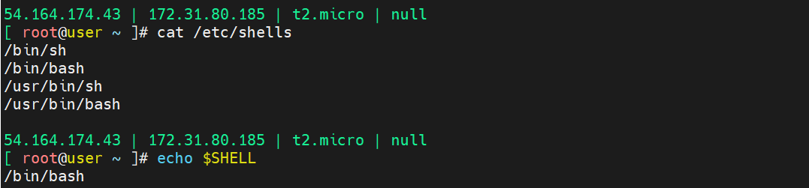

# Shell Scripting
# What is Shell?
-->Shell will allows users to interact with the operating system by executing the commands.
-->There are various types of shells, including:
    1. Bourne Shell (sh)
    2. Bash (Bourne Again Shell
    3. ZShell
    4. CShell
    5. PowerShell

# What is Shell Scripting
--> Shell scripting refers to writing scripts or programs that are interpreted by a shell to automate tasks or perform various operations on a computer system.

# Display all the Shells in Linux
    $ cat /etc/shells

# Display Default Shell of Linux
    $ echo $SHELL
    

# Most commonly used Shell is "Bash Shell"

# What is SheBang in Shell Scripting
--> SheBang is used to specify which shell should be used to process our script.
--> Every Script file first line we should specify below line
        #!/bin/bash 
    indicates that the Bash shell interpreter located at /bin/bash should be used to execute the script.

# Write Shell Script by using below scenarios
    1. check root user or not
    2. if not root user, exit the program and inform user to run with sudo access
    3. if root user install mysql

